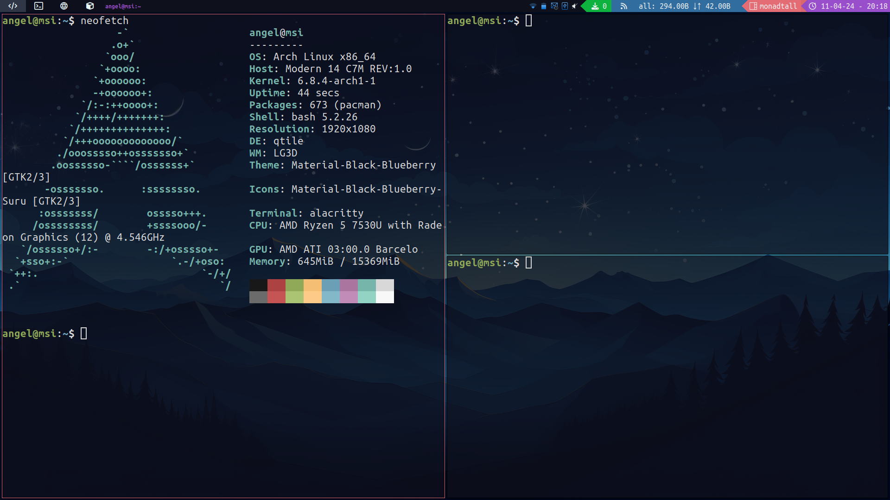

# Dotfiles & Configs Arch Linux

# Table of contents

## Overview

This guide will walk you through the process of building a desktop environment starting with a fresh Arch based installation. I will assume that you are comfortable with Linux based operating systems and command line interfaces. Because you are reading this, I will also assume that you've looked through some "tiling window manager" videos on Youtube, because that's where the rabbit hole starts. You can pick any window managers you want, but I'm going to use Qtile as a first tiling window manager because that's what I started with. This is basically a description of how I made my desktop environment from scratch.

## Qtile



## Arch Installation

The starting point of this guide is a right after a complete clean Arch based distro installation.

## Login and window manager

First, we need to be able to login and open some programs like a browser and a terminal, so we'll start by installing lighdm and qtile. Lightdm will not work unless we install a greeter. We also need xterm because that's the terminal emulator qtile will open by default, until we change the config file. Then, a text editor is necessary for editing config files, you can use vscode or jump straight into neovim if you have previous experience, otherwise I wouldn't suggest it. Last but not least, we need a browser.

# Basic Software

## Window manager & browser & terminal

```bash
sudo pacman -S lightdm lightdm-gtk-greeter qtile xterm code firefox
```

## Audio

```bash
sudo pacman -S pulseaudio pavucontrol
```

## Basic Qtile configuration

Now that you're in Qtile, you should know some of the default keybindings.

## Brightness

Config keys laptop of brightness.

```bash
sudo pacman -S brightnessctl
```

## Wallapaper

Install the software feh to set the wallpaper
Configure your **.xprofile** file to set your background when you boot your PC

```bash
sudo pacman -S feh
feh --bg-scale /path/to/image.jpg
```

## Displays

Manejar mas de un monitor

```bash
sudo pacman -S arandr
```

Poner el comando en **xprofile** despues de configurar el monitor

## YAY INSTALL

# Apps

| Key             | Action                      |
| --------------- | --------------------------- |
| mod + m         | Launch rofi                 |
| mod + shift + m | Window nav (rofi)           |
| mod + b         | Lunch Browser(Firefox)      |
| mod + e         | Lunch File explores(thunar) |
| mod + return    | Luch Terminal (Alacritty)   |
| mod + r         | Redshift                    |
| mod + shift + r | Stop redshift               |
| mod + s         | screenshot (scrot)          |

# Software

## Basic utilities

| Software               | Utility                 | Pacman                                |
| ---------------------- | ----------------------- | ------------------------------------- |
| Networkmanager         | Self explanatory        | sudo pacman -S networkmanager         |
| Alacritty              | Terminal emulator       | sudo pacman -S alacritty              |
| Pulse Audio            | Audio                   | Sudo pacman -S pulseaudio             |
| Vlc                    | Show VIdeo              | Sudo pacman -S vlc                    |
| imv                    | Show images             | sudo pacman -S imv                    |
| scrot                  | Screenshots             | Sudo pacman -S scrot                  |
| thunar                 | Graphical file explorer | sudo pacman -S thunar                 |
| Unzip                  | Descomprimir file       | sudo pacman -S unzip                  |
| xappearance            | Change theme            | sudo pacman -S lxappearance           |
| xcb-util-cursor        | Change theme cursor     | sudo pacman -S xcb-util-cursor        |
| network-manager-applet | Wifi icon               | sudo pacman -S network-manager-applet |
| cbattion               | Baterry Icon            | sudo pacman -S cbattion               |
| notification deamon    | Notification            | sudo pacman -S notification-daemon    |
| lib notify             | Recibir notificaciones  | sudo pacman -S libnotify              |

Super comand for install all
yay -Qe

```bash
sudo pacman -S
```

## Fonts, theming and GTK

| Software  | Utility           |
| --------- | ----------------- |
| Alacritty | Terminal emulator |
| Celda4    | Celda5            |

## Apps

| Software  | Utility                 |
| --------- | ----------------------- |
| Alacritty | Terminal emulator       |
| Thunar    | Graphical file explorer |
| ranger    | Terminal based explorer |
| scrot     | Screenshot              |
| neovim    | Terminal based editor   |
| rofi      | Take care of yout eyes  |
| trayer    | Systray                 |
