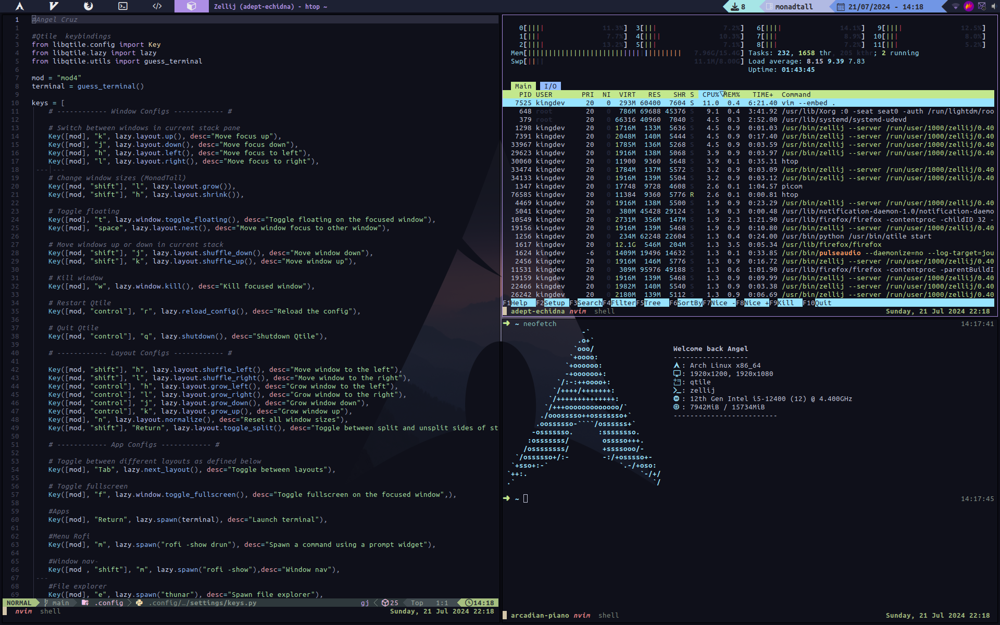

# Dotfiles & Arch Linux

This is my desktop environment on Arch Linux. Currently, this setup
is supported on a laptop, an MSI Notebook with an AMD Ryzen 5-7530U
processor, and within my personal desktop with support for two monitors,
24 and 26 inches respectively.

## Table of contents

- [Dotfiles \& Arch Linux](#dotfiles--arch-linux)
  - [Table of contents](#table-of-contents)
  - [Overview](#overview)
  - [Arch Installation](#arch-installation)
  - [Install Xorg](#install-xorg)
  - [Login and window manager](#login-and-window-manager)
  - [Initial software](#initial-software)
    - [Enable login manager](#enable-login-manager)
    - [Clone repository](#clone-repository)
    - [Install Fonts](#install-fonts)
    - [Copy config](#copy-config)
    - [Rebooting the PC](#rebooting-the-pc)
  - [Install Arch User Repository (AUR)](#install-arch-user-repository-aur)
  - [Audio](#audio)
  - [Bluetooth](#bluetooth)
  - [Brightness](#brightness)
  - [Wallapaper](#wallapaper)
  - [Monitors](#monitors)
  - [Keybindings](#keybindings)
  - [Apps](#apps)
  - [Gallery](#gallery)
    - [Qtile](#qtile)
  - [Software](#software)
  - [Audio \& bluetooth](#audio--bluetooth)
  - [Video \& Images](#video--images)
  - [Terminal](#terminal)
  - [Text editor](#text-editor)
  - [Neovim](#neovim)
  - [Additional features](#additional-features)
  - [Fonts, theming and GTK](#fonts-theming-and-gtk)
  - [Testing your window manager](#testing-your-window-manager)
    - [How to use my setup](#how-to-use-my-setup)

## Overview

This guide will walk you through the process of building
a desktop environment starting with a fresh Arch based installation.
I will assume that you are comfortable with Linux based operating systems
and command line interfaces. Because you are reading this,
I will also assume that you've looked through some
"tiling window manager" videos on Youtube,
because that's where the rabbit hole starts.
You can pick any window managers you want,
but I'm going to use Qtile as a first tiling
window manager because that's what I started with.
This is basically a description of how I made my desktop environment from scratch.

## Arch Installation

The starting point of this guide is a right after
a complete clean Arch based distro installation.
Wiki [arch](https://wiki.archlinux.org/title/installation_guide)
My recomendations [Installation](/install/README.md)

## Install Xorg

Xorg is an implementation of the X Window System for Unix-like operating systems, such as Linux. It is one of the key components for providing a graphical interface on these systems.

[xorg](https://wiki.archlinux.org/title/Xorg)

```bash
sudo pacman -S xorg
```

## Login and window manager

First, we need to be able to login and open some programs
like a browser and a terminal, so we'll start by installing
lighdm and qtile. Lightdm will not work unless we install a greeter.
We also need xterm because that's the terminal emulator qtile
will open by default, until we change the config file. Then,
a text editor is necessary for editing config files, you can
use vscode or jump straight into neovim if you have previous
experience, otherwise I wouldn't suggest it. Last but not
least, we need a browser.

## Initial software

First, we need to install the basic software to make my configuration work.

```bash
sudo pacman -S lightdm lightdm-gtk-greeter
lightdm-webkit2-greeter qtile alacritty
firefox rofi neofetch htop base-devel
pulseaudio pavucontrol feh exa neovim
flameshot unzip thunar picom arandr brightnessctl
```

Info about this software in [Software](#software)

### Enable login manager

To be able to log in to Qtile, you will need to enable it first.

```bash
sudo systemctl enable lightdm
```

### Clone repository

Clone the repository of my configurations.

```bash
git clone https://github.com/angelcruz07/dotfiles.git
```

### Install Fonts

Before continuing, let's install the fonts used in my configuration. In my case, I use UbuntuMono Nerd Font and CascadiaCode.

```bash
sudo pacman -S ttf-ubuntu-mono-nerdfont ttf-cascadia-code
```

### Copy config

Copy my configuration to see the changes.

```bash
cp -r ~/dotfiles/AlexcodeDesktop/.config ~/
```

### Rebooting the PC

Restart your PC to check if everything has gone well.

```bash
reboot
```

Take a look at the configured [keyboard shortcuts](#keybindings).

If you've followed the steps correctly, you should see my environment with the theme I'm currently using.

## Install Arch User Repository (AUR)

```bash
# Verify if you have git installed
sudo pacman -S git

# Clone repository
sudo git clone https://aur.archlinux.org/yay-git.git

# Install yay
sudo chown -R youruser:youruser ./yay-git

cd yay-git

makepkg -si

rm -r yay-git
```

## Audio

```bash
sudo pacman -S pulseaudio pavucontrol
```

## Bluetooth

```bash
sudo systemctl start bluetooth.service
sudo systemctl enable bluetooth.service
sudo systemctl status bluetooth.service
```

## Brightness

Config keys laptop of brightness.

```bash
sudo pacman -S brightnessctl
```

## Wallapaper

Install the software feh to set the wallpaper
Configure your **.xprofile** file to set your
background when you boot your PC.

```bash
# Install feh
sudo pacman -S feh

# Set wallpaper in your file .xprofile
feh --bg-scale /path/to/image.jpg
```

## Monitors

Install graphic software for managing monitors

```bash
sudo pacman -S arandr
```

Check my config in [xprofile](/.xprofile)

## Keybindings

| Key                 | Action                           |
| ------------------- | -------------------------------- |
| mod + j             | next window (down)               |
| mod + k             | next window (up)                 |
| mod + shift + h     | decrease master                  |
| mod + shift + l     | increase master                  |
| mod + shift + j     | move window down                 |
| mod + shift + k     | move window up                   |
| mod + shift + f     | toggle floating                  |
| mod + tab           | change layout                    |
| mod + [1-9]         | Switch to workspace N (1-9)      |
| mod + shift + [1-9] | Send Window to workspace N (1-9) |
| mod + period        | Focus next monitor               |
| mod + comma         | Focus previous monitor           |
| mod + w             | kill window                      |
| mod + ctrl + r      | restart wm                       |
| mod + ctrl + q      | quit window                      |

## Apps

| Key             | Action                      |
| --------------- | --------------------------- |
| mod + m         | Launch rofi                 |
| mod + shift + m | Window nav (rofi)           |
| mod + b         | Lunch Browser(Firefox)      |
| mod + e         | Lunch File explores(thunar) |
| mod + return    | Luch Terminal (Alacritty)   |
| mod + r         | Redshift                    |
| mod + shift + r | Stop redshift               |
| mod + s         | Screenshot (scrot)          |
| mod + c         | Launch VsCode               |

## Gallery

My setup has the followig themes avaible.

### Qtile

- Dracula
  
- Tokyo night
  
- King
- Dark-grey
- Material-darker
- Material-ocean
- Monokai-pro
- Nord-wave
- Nord

## Software

List of software used in the desktop environment.

| Software               | Utility                                |
| ---------------------- | -------------------------------------- |
| arandr                 | Manage multiple screens                |
| bat                    | View files with syntax highlighting    |
| blueman                | Bluetooth control                      |
| bluez                  | Bluetooth stack                        |
| bluez-utils            | Bluetooth utilities                    |
| brightnessctl          | Laptop screen brightness               |
| cbatticon              | Battery icon                           |
| exa                    | List files visually                    |
| feh                    | Wallpaper setter                       |
| flameshot              | Screenshot                             |
| libnotify              | Receive notifications                  |
| lxappearance           | GUI for changing themes                |
| network-manager-applet | NetworkManager systray                 |
| networkmanager         | Self explanatory                       |
| notification-daemon    | Notifications                          |
| ntfs-3g                | Read mounted USB in Windows            |
| picom                  | Compositor for Xorg                    |
| pip                    | Python package manager                 |
| pulseaudio             | Audio control                          |
| pulseaudio-bluetooth   | Bluetooth audio support for PulseAudio |
| qiv                    | Image viewer                           |
| ranger                 | Terminal based explorer                |
| rofi                   | Menu and window switcher               |
| scrot                  | Screenshots                            |
| thunar                 | Graphical file explorer                |
| udiskie                | Automounter                            |
| unzip                  | Unzip files                            |
| vlc                    | Media player                           |
| volumeicon             | Audio icon                             |
| xcb-util-cursor        | Change theme cursor                    |

## Terminal

| Software  | Utility           | Pacman                   |
| --------- | ----------------- | ------------------------ |
| Alacritty | Terminal emulator | sudo pacman -S alacritty |
| Kitty     | Terminal emulator | sudo pacman -S kitty     |

## Neovim

| Software          | Utility   | Pacman                             |
| ----------------- | --------- | ---------------------------------- |
| xsel              | Clipboard | sudo pacman -S xsel                |
| fzf               | Finder    | sudo pacman -S fzf                 |
| ripgrep           | Finder    | sudo pacman -S ripgrep             |
| fd                | Finder    | sudo pacman -S fd                  |
| the_silver_search |           | sudo pacman -S the_silver_searcher |
| prettier          | Formater  | sudo pacman -S prettier            |

More info [Neovim](https://neovim.io/)

## Fonts, theming and GTK

| Software              | Utility                                                                                     |
| --------------------- | ------------------------------------------------------------------------------------------- |
| UbuntuMono Nerd Fonts | [Font](https://archlinux.org/packages/extra/any/ttf-ubuntu-mono-nerd/)                      |
| Cascadia Code         | [Font](https://archlinux.org/packages/extra/any/ttf-cascadia-code/)                         |
| Theme GTK             | [Icons](https://www.gnome-look.org/p/1333360) [Theme](https://www.gnome-look.org/p/1316887) |

## Testing your window manager

[Xephyr](https://wiki.archlinux.org/title/Xephyr)

### How to use my setup

After a clean installation of Archlinux.

- Installl software

```bash
sudo pacman -S lightdm lighdm-gtk-greeter lightdm-webkit2-greeter
qtile alacritty firefox rofi neofetch htop rofi neofetch htop
base-devel exa neovim flameshot unzip thunar pulseaudio pavucontrol
brightnessctl feh arandr picom --neoconfirm
```

- Copy my .config of desktop

```bash
cp -r ~/dotfiles/AlexcodeDesktop/.config/ ~/
```

1. Copy _.bashrc_

```bash
cp -r ~/dotfiles/.bashrc/ ~/
```

5. Copy _.xprofile_

```bash
cp -r ~/dotfiles/.xprofile ~/
```
